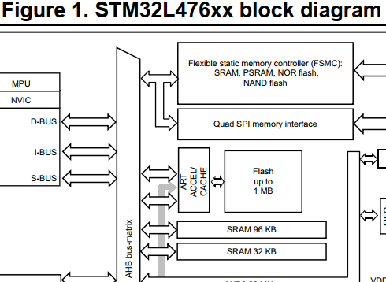
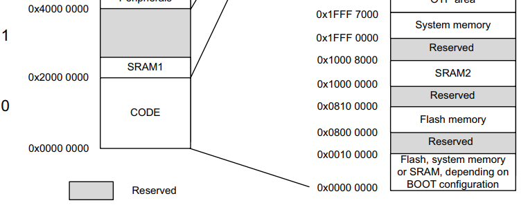
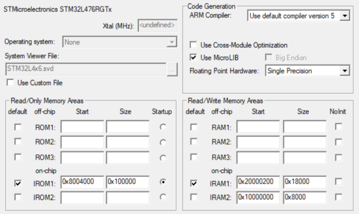
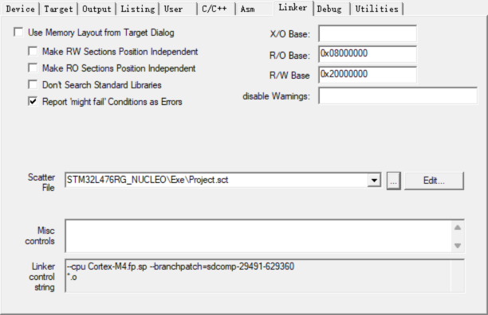
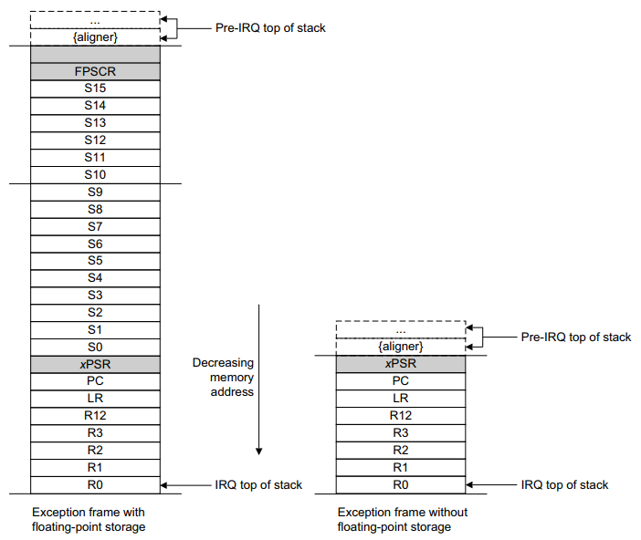
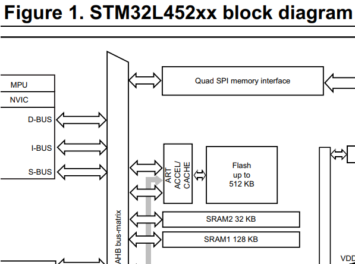
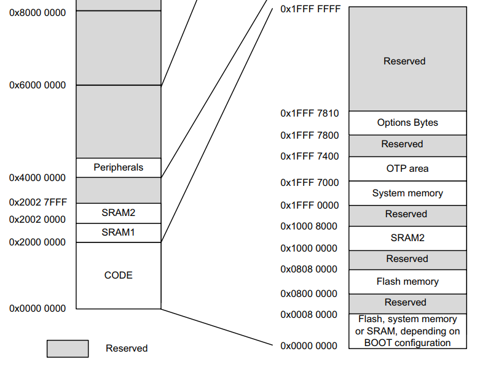

### 1. 背景

最近看到了一篇介绍 SecureSMX 的文章，标题是“Secure RTOS enables high security for microcontroller systems”，在标题中就直接标榜这个操作系统安全性高，很好奇，一个 RTOS 是如何实现高安全性的，于是草草读了一下，了解到部分安全性是通过 Cortex-v7M 的 MPU 实现的。看完初步了解了一下 MPU 的功能，可以配置规则，为不同地址空间的访问规划所需的特权级别、读写权限等。

仅看 STM32 单片机的 MPU 示例代码是无法了解到 MPU 是怎么和操作系统结合到一起的，比如：`STM32Cube_FW_L4_V1.17.1\Projects\NUCLEO-L476RG\Examples_LL\CORTEX\CORTEX_MPU`，因为按照示例代码的配置，一旦配置好，CPU 就只能按照配置的规则访问对应的地址空间，那操作系统如何用它来隔离内核和任务，以及任务和任务呢？带着这个问题，我读了一遍 `NUCLEO-L476RG\Examples_LL\CORTEX\CORTEX_MPU`，并将其移植到 NUCLEO-L452RE 上进行了测试。

### 2. 示例代码走读

示例代码位于 STM32CubeMX 的安装目录下：

```
STM32Cube\Repository\STM32Cube_FW_L4_V1.17.1\Projects\NUCLEO-L476RG\Applications\FreeRTOS\FreeRTOS_MPU
```

#### (1) MPU 配置

L476RG 资源：

- FLASH: 0x08000000 - 0x08100000 (1M)

- SRAM：两个区域，共 128K
- SRAM1：96K，0x20000000 - 0x20018000 
  - SRAM2：32K，0x10000000 - 0x10008000






Target 配置（并没有修改 system_stm32l4xx.c 中，中断向量表的偏移，即仍是放在 0x08000000 位置，下面的工程应该没法运行才对）：



结合 Linker 选项看，实际上没有使用 Target 中的分区，而是在由 Project.sct 文件定义的：



Project.sct：

```
LR_IROM1 0x08000000 0x00100000  {       ; load region size_region, 装载区域
                                        ; LR_IROM1, 这是一个名字，随便起。可以理解为一块存储器的名字。
                                        ; 0x08000000，这是起始地址。
                                        ; 0x00100000，代表size，也就是存储器的最大空间。
  ER_IROM2 0x08000000  {                ; 执行区域
   *.o (RESET, +First)                  ; *.o, 是说对于任意的".o"文件
                                        ; RESET 是说含有“RESET”的 section 名称的
                                        ; +First 是说最先匹配
                                        ; 合起来就是在所有的“.o”文件中找到含有“RESET”字段的内容放到“ER_IROM2"这块存储区域内

   *(InRoot$$Sections)                  ; load address = execution address
   *(privileged_functions)              ; 含有 “privileged_functions”的 section 名称的
  }
ER_IROM1 0x08004000 FIXED  0x00FC000{   ; load address = execution address
   .ANY (+RO)                           ; '.ANY' 可以理解成 '*' ，是说把剩下的RO类型的数据（常量和代码）放到这里。
  }
  RW_IRAM2 0x20000000 0x000200  {       ; RW data
  *(privileged_data)                    ; 含有 “privileged_data”的 section 名称的
   }
  RW_IRAM1 0x20000200 0x000017E00  {    ; RW data
   .ANY (+RW +ZI)                       ; 是说把剩下的RW,ZI类型的数据（常量和代码）放到这里。
  }
}
```

结合代码，可以看到，把 Flash 的前 0x4000 字节和 RAM 的前 0x200 字节保留出来了，用于放置操作系统内核的代码和数据。

涉及到的段名实际上是代码中指定的（FreeRTOS\include\mpu_wrappers.h）：

```c
#define PRIVILEGED_FUNCTION __attribute__((section("privileged_functions")))
#define PRIVILEGED_DATA __attribute__((section("privileged_data")))
#define FREERTOS_SYSTEM_CALL _attribute__((section( "freertos_system_calls")))
```

`PRIVILEGED_FUNCTION`、`PRIVILEGED_DATA` 等宏，在 FreeRTOS 的函数定义中出现了，只不过不用 MPU 时，对应的定义是空的，需要使用 MPU 时，需要进行定义，并且 sct 文件中要与其一致：

```c
/*
 * The number of bytes available to be read from the buffer.
 */
static size_t prvBytesInBuffer( const StreamBuffer_t * const pxStreamBuffer ) PRIVILEGED_FUNCTION;
```

未使用 MPU 时：

```c
#define PRIVILEGED_FUNCTION
#define PRIVILEGED_DATA
#define FREERTOS_SYSTEM_CALL
#define portUSING_MPU_WRAPPERS    0
```

Flash 及 RAM 区域划分（port.c 中的 prvSetupMPU 函数内会将该区域配置到 MPU 当中）：

```c
const uint32_t * __FLASH_segment_start__ = ( uint32_t * ) 0x08000000UL;
const uint32_t * __FLASH_segment_end__ = ( uint32_t * ) 0x080FFFFF; /* 根据prvSetupMPU 中的注释描述，该段区域对应整段 FLASH 空间，非特权，只读 */
const uint32_t * __SRAM_segment_start__ = ( uint32_t * ) 0x20000000UL;
const uint32_t * __SRAM_segment_end__ = ( uint32_t * ) 0x20001FFF;
const uint32_t * __privileged_functions_start__ = ( uint32_t * ) 0x08000000UL;
const uint32_t * __privileged_functions_end__ = ( uint32_t * ) 0x08003FFFUL; /* 根据prvSetupMPU 中的注释描述，该段区域放置的是内核的代码 */
const uint32_t * __privileged_data_start__ = ( uint32_t * ) 0x20000000UL;
const uint32_t * __privileged_data_end__ = ( uint32_t * ) 0x200001FFUL; /* 根据prvSetupMPU 中的注释描述，该段区域放置的是内核的数据 */
外设地址区域 /* 在 prvSetupMPU 中配置，都可以访问 */
```

Cortex-M4 的 MPU 支持 8 个范围，当然，允许在每个范围的内部进一步划分更小的块，具体的限制可以去看《Cortex-M4 Devices Generic User Guide》或《Cortex-M3权威指南》。MPU 可以设置的范围大小只能是 2 的次幂，最小 32 字节，最大可达 4GB。

具体在示例代码中，MPU 的 8 个范围分配如下：

```c
#define portUNPRIVILEGED_FLASH_REGION       ( 0UL )
#define portPRIVILEGED_FLASH_REGION         ( 1UL )
#define portPRIVILEGED_RAM_REGION           ( 2UL )
#define portGENERAL_PERIPHERALS_REGION      ( 3UL )
#define portSTACK_REGION                    ( 4UL )
#define portFIRST_CONFIGURABLE_REGION       ( 5UL )
#define portLAST_CONFIGURABLE_REGION        ( 7UL )
#define portNUM_CONFIGURABLE_REGIONS        ( ( portLAST_CONFIGURABLE_REGION - portFIRST_CONFIGURABLE_REGION ) + 1 )
#define portTOTAL_NUM_REGIONS               ( portNUM_CONFIGURABLE_REGIONS + 1 ) /* Plus one to make space for the stack region. */
```

前 4 个范围的配置是在 prvSetupMPU 函数中完成的：

- 第一个区域对应于整个 Flash 空间，特权极和用户级下只读，大小 1M
- 第二个区域对应于 Flash 前 16K 区域，特权级只读，用户级禁止访问（内核代码）
- 第三个区域对应于 RAM 前 512 字节，特权级下读写，用户级禁止访问（内核数据）
- 第四个区域对应于 RAM 中外设的地址（0x40000000-0x5FFFFFFF），特权级和用户级下都可以读写

除此之外还使能了背景范围。

```c
static void prvSetupMPU( void )
{
extern uint32_t __privileged_functions_end__;
extern uint32_t __FLASH_segment_start__;
extern uint32_t __FLASH_segment_end__;
extern uint32_t __privileged_data_start__;
extern uint32_t __privileged_data_end__;
        /* Check the expected MPU is present. */
    if( portMPU_TYPE_REG == portEXPECTED_MPU_TYPE_VALUE )
    {
                /* 第一个区域对应于整个 Flash 空间，特权极和用户级下只读，大小 1M */
        /* First setup the entire flash for unprivileged read only access. */
        portMPU_REGION_BASE_ADDRESS_REG =   ( ( uint32_t ) __FLASH_segment_start__ ) | /* Base address. */
                                            ( portMPU_REGION_VALID ) |
                                            ( portUNPRIVILEGED_FLASH_REGION );
        portMPU_REGION_ATTRIBUTE_REG =  ( portMPU_REGION_READ_ONLY ) |
                                        ( portMPU_REGION_CACHEABLE_BUFFERABLE ) |
                                        ( prvGetMPURegionSizeSetting( ( uint32_t ) __FLASH_segment_end__ - ( uint32_t ) __FLASH_segment_start__ ) ) |
                                        ( portMPU_REGION_ENABLE );

        /* 第二个区域对应于 Flash 前 16K 区域，特权级只读，用户级禁止访问（内核代码） */
                /* Setup the first 19K for privileged only access (even though less
        than 10K is actually being used).  This is where the kernel code is
        placed. */
        portMPU_REGION_BASE_ADDRESS_REG =   ( ( uint32_t ) __FLASH_segment_start__ ) | /* Base address. */
                                            ( portMPU_REGION_VALID ) |
                                            ( portPRIVILEGED_FLASH_REGION );
        portMPU_REGION_ATTRIBUTE_REG =  ( portMPU_REGION_PRIVILEGED_READ_ONLY ) |
                                        ( portMPU_REGION_CACHEABLE_BUFFERABLE ) |
                                        ( prvGetMPURegionSizeSetting( ( uint32_t ) __privileged_functions_end__ - ( uint32_t ) __FLASH_segment_start__ ) ) |
                                        ( portMPU_REGION_ENABLE );

                /* 第三个区域对应于 RAM 前 512 字节，特权级下读写，用户级禁止访问（内核数据） */
        /* Setup the privileged data RAM region.  This is where the kernel data
        is placed. */
        portMPU_REGION_BASE_ADDRESS_REG =   ( ( uint32_t ) __privileged_data_start__ ) | /* Base address. */
                                            ( portMPU_REGION_VALID ) |
                                            ( portPRIVILEGED_RAM_REGION );
        portMPU_REGION_ATTRIBUTE_REG =  ( portMPU_REGION_PRIVILEGED_READ_WRITE ) |
                                        ( portMPU_REGION_CACHEABLE_BUFFERABLE ) |
                                        prvGetMPURegionSizeSetting( ( uint32_t ) __privileged_data_end__ - ( uint32_t ) __privileged_data_start__ ) |
                                        ( portMPU_REGION_ENABLE );

        /* 第四个区域对应于 RAM 中外设的地址（0x4000 0000-0x5FFF FFFF），特权级和用户级下都可以读写 */
        /* By default allow everything to access the general peripherals.  The
        system peripherals and registers are protected. */
        portMPU_REGION_BASE_ADDRESS_REG =   ( portPERIPHERALS_START_ADDRESS ) |
                                            ( portMPU_REGION_VALID ) |
                                            ( portGENERAL_PERIPHERALS_REGION );
        portMPU_REGION_ATTRIBUTE_REG =  ( portMPU_REGION_READ_WRITE | portMPU_REGION_EXECUTE_NEVER ) |
                                        ( prvGetMPURegionSizeSetting( portPERIPHERALS_END_ADDRESS - portPERIPHERALS_START_ADDRESS ) ) |
                                        ( portMPU_REGION_ENABLE );
        /* Enable the memory fault exception. */
        portNVIC_SYS_CTRL_STATE_REG |= portNVIC_MEM_FAULT_ENABLE;
        /* Enable the MPU with the background region configured. */
        portMPU_CTRL_REG |= ( portMPU_ENABLE | portMPU_BACKGROUND_ENABLE );
    }
}
```

剩下的四个范围留给了任务，三个用于创建任务时指定可以访问的区域，最后一个用于保护任务的栈空间。这四个是什么时候配到 MPU 中的？如果是搜索 MPU 相关结构体或宏定义，是无法搜索到的。

每个任务的 MPU 配置是在任务初始化的时候，存到了各自 TCB 的 xMPUSettings 成员中：

```c
typedef struct tskTaskControlBlock          /* The old naming convention is used to prevent breaking kernel aware debuggers. */
{
    volatile StackType_t    *pxTopOfStack;  /*< Points to the location of the last item placed on the tasks stack.  THIS MUST BE THE FIRST MEMBER OF THE TCB STRUCT. */
    #if ( portUSING_MPU_WRAPPERS == 1 )
        xMPU_SETTINGS   xMPUSettings;       /*< The MPU settings are defined as part of the port layer.  THIS MUST BE THE SECOND MEMBER OF THE TCB STRUCT. */
    #endif

        /* 后面的成员就不列在这里了 */
} tskTCB;
```

PendSV 中断函数中切换任务时，会将 xMPUSettings 的内容配置到 MPU 中去：

```c
__asm void xPortPendSVHandler( void )
{
    extern uxCriticalNesting;
    extern pxCurrentTCB;
    extern vTaskSwitchContext;
    PRESERVE8
    mrs r0, psp                     /* 读取进程栈指针，保存在 r0 里面*/
    ldr r3, =pxCurrentTCB           /* Get the location of the current TCB. */
    ldr r2, [r3]                    /* 将 r3 的值保存到 r2 中*/
    tst r14, #0x10                  /* Is the task using the FPU context?  If so, push high vfp registers. */
    it eq
    vstmdbeq r0!, {s16-s31}         /* r0 保存的是 psp 的值，因此，该行是寄存器入任务栈，是从右到左执行的，因此，入栈顺序是 s31，s30 …… s16。 */
    mrs r1, control                 /* 将 control 寄存器的内容读到 r1 中 */
    stmdb r0!, {r1, r4-r11, r14}    /* r0 保存的是 psp 的值，该行时寄存器入任务栈，顺序是从右到左，因此，入栈顺序是 r14，r11 …… r4，r1。 */
    str r0, [r2]                    /* Save the new top of stack into the first member of the TCB. */
    stmdb sp!, {r0, r3}             /* r0  和 r3 入主栈，r0 保存了最近的栈顶，r3 保存了当前任务的控制块。
                                       后面要用到 r0，因此 r0 先临时入主栈，再往后要调用 vTaskSwitchContext，
                                       r3 的值也可能变，因此，r3 也临时入主栈。入栈顺序是 r3，r0。
                                    */
    mov r0, #configMAX_SYSCALL_INTERRUPT_PRIORITY /* r0 的值修改为 configMAX_SYSCALL_INTERRUPT_PRIORITY */
    msr basepri, r0                 /* 屏蔽值大于等于 r0 的值的中断 */
    dsb
    isb
    bl vTaskSwitchContext
    mov r0, #0                      /* r0 的值修改为 0 */
    msr basepri, r0                 /* 屏蔽值大于等于 r0 的值的中断 */
    ldmia sp!, {r0, r3}             /* 出栈，从左到右，先出 r0，再出 r3。 */
                                    /* Restore the context. */
    ldr r1, [r3]
    ldr r0, [r1]                    /* The first item in the TCB is the task top of stack. */
    add r1, r1, #4                  /* Move onto the second item in the TCB... */
                                    /* TCB 结构体的第二个成员，实际上就是任务的 xMPUSettings 成员，里面存放了该任务对应的 MPU 配置 */
    ldr r2, =0xe000ed9c             /* Region Base Address register. */
                                    /* 读取 MPU_RBAR 寄存器的值 */
    ldmia r1!, {r4-r11}             /* Read 4 sets of MPU registers. */
                                    /* r1 的值作为地址，从该地址开始传送数据，每次传送后地址加 4，依次放在 r4 ~ r11 寄存器中，最后的地址写回 r1。
                                       即，从 xMPUSettings 的首地址读 32 个字节，该结构体包含 4 个 MPU 条目，每个条目 8 个字节。
                                       意味着此处的代码与 TCB xMPUSettings 结构体的大小严格对应。
                                    */
    stmia r2!, {r4-r11}             /* Write 4 sets of MPU registers. */
                                    /* r2 的值作为地址，向该地址传送数据，每次传送后地址加 4，依次传送 r4 ~ r11 中的值，最后的地址写回 r2。
                                       r2 的值是 MPU 的 RBAR 寄存器的地址，所以这行代码的作用就是把 xMPUSettings 的内容写入 MPU。
                                       具体的，r2 的初始地址为 0xe000 ed9c，先把 r4 的值写入 0xe000 ed9c，地址加 4，写入下一个寄存器的值，
                                       最后的效果就是：
                                       0xe000ed9c （MPU_RBAR），值为 r4 的值
                                       0xe000eda0 （MPU_RASR），值为 r5 的值
                                       0xe000eda4 （MPU_RBAR_A1），值为 r6 的值
                                       0xe000eda8 （MPU_RASR_A1），值为 r7 的值
                                       0xe000edac （MPU_RBAR_A2），值为 r8 的值
                                       0xe000edb0 （MPU_RASR_A2），值为 r9 的值
                                       0xe000edb4 （MPU_RBAR_A3），值为 r10 的值
                                       0xe000edb8 （MPU_RASR_A3），值为 r11 的值
                                       后面的用的是寄存器的别名机制，都是 MPU_RBAR 和 MPU_RASR 的别名，实际上写的还是 MPU_RBAR 和 MPU_RASR。
                                    */
    ldmia r0!, {r3-r11, r14}        /* Pop the registers that are not automatically saved on exception entry. */
                                    /* r0 保存了 TCB 的第一个成员，即任务栈的栈顶指针，所以，该行是任务栈出栈，顺序从左到右执行，出栈顺序是 r3 …… r11，r14。 */
    msr control, r3
    tst r14, #0x10                  /* Is the task using the FPU context?  If so, pop the high vfp registers too. */
    it eq
    vldmiaeq r0!, {s16-s31}
    msr psp, r0
    bx r14
    nop
}
```

#### (2) **上下文切换时的入栈和出栈分析**

既然已经看到 PendSV 函数了，那顺便分析一下压栈的情况。

Cortex-M4F 的栈是递减栈，即向低地址增长。任务栈压栈时，一部分是硬件完成的（发生 PendSV 中断时，会自动将一部分寄存器压到任务栈中），另一部分是软件完成的，也就是在上面的 `xPortPendSVHandler` 内完成的，任务可能使用 FPU，那么就需要把浮点寄存器也压到栈里，也可能不使用 FPU，浮点寄存器就不需要入栈了。

硬件入栈的内容如下：



左边是使用了 FPU 的情况，右边是没有使用 FPU 的情况。由于硬件已经将部分寄存器压栈了，因此，`xPortPendSVHandler` 一开始就可以使用 r0 ~ r3 寄存器。

软件压栈的这部分内容，不同的代码可能不同，比如上述代码，由于使用了 MPU，涉及到运行时特权等级的切换，需要额外记录 control 寄存器的值，于是，最终 r3 入栈了两次，一次是硬件自动压栈，另一次是上述函数中保存 control 寄存器的值后，软件主动入栈。在进行栈回溯时需要特别注意这一点，即，压栈内容要结合具体的代码进行分析。

#### (3) 任务的特权等级、MPU 配置

任务：

| 名称                        | MPU 区域                                                     | 创建时的特权等级                  | 运行时的特权等级                                             | 访问队列的方式                                               |
| --------------------------- | ------------------------------------------------------------ | --------------------------------- | ------------------------------------------------------------ | ------------------------------------------------------------ |
| Test1Task  (Test1Task)      | {    /* Base address, Length, Parameters */ <br>    {0x00, 0x00, 0x00},<br>    {0x00, 0x00, 0x00},<br/>    {0x00, 0x00, 0x00}<br/>} | 特权模式  (xTaskCreateRestricted) | 用户模式                                                     | 在特权模式下创建，因此可以访问所在文件范围内可见的队列句柄变量，在进入用户模式前，将队列句柄变量的副本（指针）保存的栈里面，进入用户模式后，所在文件范围内的队列句柄就不可以访问了，但是栈里面的副本可以访问。 |
| Test2Task                   | {    /* Base address, Length, Parameters */<br/>    {0x00, 0x00, 0x00},<br/>    {0x00, 0x00, 0x00},<br/>    {0x00, 0x00, 0x00}<br/>  } | 用户模式  (xTaskCreateRestricted) | 用户模式                                                     | 通过传参的方式，将队列句柄传给任务的执行函数。               |
| CheckTask                   | {    /* Base address, Length, Parameters */<br/>    {ReadWriteArray, 128, portMPU_REGION_READ_WRITE},<br/>    {ReadOnlyArray, 256, portMPU_REGION_READ_ONLY},<br/>    {PrivilegedOnlyAccessArray, 128, portMPU_REGION_PRIVILEGED_READ_WRITE}<br/>} | 特权模式  (xTaskCreateRestricted) | 用户模式  （任务执行函数中主动调用 portSWITCH_TO_USER_MODE 切换到用户模式） | 同 Test1Task。                                               |
| Task1  (UserModeTask)       | Flash  和 RAM 中所有未被标记为“仅特权访问”的区域。           | 用户模式  (xTaskCreate)           | 用户模式                                                     | （不访问队列）                                               |
| Task2  (PrivilegedModeTask) | Flash  和 RAM 的所有区域（包含被标记为 “仅特权访问”的区域）。 | 特权模式  (xTaskCreate)           | 特权模式                                                     | （不访问队列）                                               |

#### (4) 任务需要访问操作系统数据时的情形

按照前面的配置，任务在用户模式下执行时，能访问的 RAM 区域只有该任务的栈以及通过 MPU 给该任务配置的区域。Test1Task 和 Test2Task 在用户模式下运行，使用队列相互传递消息时需要调用内核的函数，那么，就会引发 MemManage fault。实际上，这不会导致运行在用户模式下的任务不能使用队列或者信号量来和其他任务或者中断通信。

队列和信号量使用的 RAM 属于内核，由内核控制，并且只有 CPU 运行在特权模式时才能够访问。任务调用诸如 `xQueueSend()` 之类的 API，会使 CPU 临时切换到特权模式，这样的话，需要入队的数据就可以从在用户模式下运行的任务复制到内核控制的队列区域中了。同样的，调用诸如 `xQueueReceive()` 也会使 CPU 临时切换到特权模式，这样的话，被接收的数据就可以从内核控制的队列区域复制给在用户模式下运行的任务了。所谓的“自动”，实际上也是软件主动完成的。

为了能使任务正常调用内核的接口，内核接口内部需要做修改，先将运行时的特权等级提升到特权模式，处理完具体事务后，再切换回任务调用内核接口之前的特权等级。

以 `xTaskGetTickCount` 接口为例，需要再封装一层，先判断特权等级，如果不是特权模式，就提升到特权等级，然后调用 tasks.c 中的 `xTaskGetTickCount` 函数，调用完成之后，将特权等级切换到原先的级别。

```c
#define xTaskGetTickCount                       MPU_xTaskGetTickCount
```

封装之后的函数：

```c
TickType_t MPU_xTaskGetTickCount( void ) /* FREERTOS_SYSTEM_CALL */
{
TickType_t xReturn;
BaseType_t xRunningPrivileged = xPortRaisePrivilege();
    xReturn = xTaskGetTickCount();
    vPortResetPrivilege( xRunningPrivileged );
    return xReturn;
}
```

从用户级到特权级的唯一途径是异常，异常服务例程是在特权级下运行的，处理器会先切换到特权级，再执行异常服务例程。代码中是通过发起 svc 完成的。

```c
BaseType_t xPortRaisePrivilege( void ) /* FREERTOS_SYSTEM_CALL */
{
BaseType_t xRunningPrivileged;
    /* Check whether the processor is already privileged. */
    xRunningPrivileged = portIS_PRIVILEGED();
    /* If the processor is not already privileged, raise privilege. */
    if( xRunningPrivileged != pdTRUE )
    {
        portRAISE_PRIVILEGE();
    }
    return xRunningPrivileged;
}
```

```c
/**
 * @brief Raise an SVC request to raise privilege.
 */
#define portRAISE_PRIVILEGE()       __asm { svc portSVC_RAISE_PRIVILEGE }
```

SVC 中断服务例程中的代码会去修改 Cortex 的控制寄存器，将特权等级设置为特权模式：

```c
void prvSVCHandler( uint32_t *pulParam )
{
uint8_t ucSVCNumber;
uint32_t ulReg;
    /* The stack contains: r0, r1, r2, r3, r12, r14, the return address and
    xPSR.  The first argument (r0) is pulParam[ 0 ]. */
    ucSVCNumber = ( ( uint8_t * ) pulParam[ portOFFSET_TO_PC ] )[ -2 ];
    switch( ucSVCNumber )
    {
        case portSVC_START_SCHEDULER    :   portNVIC_SYSPRI1_REG |= portNVIC_SVC_PRI;
                                            prvRestoreContextOfFirstTask();
                                            break;
        case portSVC_YIELD              :   portNVIC_INT_CTRL_REG = portNVIC_PENDSVSET_BIT;
                                            /* Barriers are normally not required
                                            but do ensure the code is completely
                                            within the specified behaviour for the
                                            architecture. */
                                            __asm volatile( "dsb" );
                                            __asm volatile( "isb" );
                                            break;
        case portSVC_RAISE_PRIVILEGE    :   __asm
                                            {
                                                mrs ulReg, control  /* Obtain current control value. */
                                                bic ulReg, #1       /* Set privilege bit. */
                                                msr control, ulReg  /* Write back new control value. */
                                            }
                                            break;
        default                         :   /* Unknown SVC call. */
                                            break;
    }
}
```

完成 `xTaskGetTickCount` 调用后，此时，仍然处于特权模式，根据调用前记录的特权级别决定是否修改控制寄存器即可。

这里还涉及到 `xTaskGetTickCount` 宏定义何时生效的问题。任务直接调用时，应该要调用宏 `xTaskGetTickCount`，展开后就是 `MPU_xTaskGetTickCount`，而 `MPU_xTaskGetTickCount` 中调用的 `xTaskGetTickCount` 就不是宏了，而是 tasks.c 中的 `TickType_t xTaskGetTickCount(void)` 函数。其他会在任务中调用的套过壳的内核接口也是这样的。需要在文件中主动 define 或 undefine MPU 相关的宏，以控制到底调用的是函数还是宏。

### 3. 代码移植

手头仅有 NUCLEO-L452 开发板。

需要注意的是，示例代码对应的 MCU 为 STM32L476RG，SRAM 被分成两个部分，SRAM1 映射到了 Cortex-M4 的 SRAM 区域，但是，SRAM2 只映射到了 Cortex-M4 的 Code 区域（Cortex-M4 的内存映射见《Cortex-M4 Devices Generic User Guide》）。

而 L452RE 的 SRAM，SRAM2 同时映射在 0x20020000 和 0x10000000，因此，可以看做连续的一块使用，也可以看做两块区域使用。





移植时，暂时按两块分开使用：

```
LR_IROM1 0x08000000 0x00040000  {       ; 装载区域，起始地址 0x0800 0000，最大空间 0x0004 0000（STM32L452RE 的 Flash 大小 256K）
  ER_IROM2 0x08000000 0x00004000  {     ; 执行区域，起始地址 0x0800 0000，最大空间 16K
   *.o (RESET, +First)                  ; *.o, 是说对于任意的".o"文件
                                        ; RESET 是说含有“RESET”的 section 名称的
                                        ; +First 是说最先匹配
                                        ; 合起来就是在所有的“.o”文件中找到含有“RESET”字段的内容放到“ER_IROM2"这块存储区域内

   *(InRoot$$Sections)                  ; load address = execution address
   *(privileged_functions)              ; 含有 “privileged_functions”的 section 名称的代码
  }
  ER_IROM1 0x08004000 FIXED 0x003C000 { ; 执行区域，起始地址 0x0800 4000，固定地址，最大空间 240K（总共 256K，第一段占了 16K）
   .ANY (+RO)                           ; '.ANY' 可以理解成 '*' ，是说把剩下的 RO 类型的数据（常量和代码）放到这里。
  }
  RW_IRAM2 0x20000000 0x00000200 {      ; 执行区域，起始地址 0x2000 0000，大小 0x200，
   *(privileged_data)                   ; 含有 “privileged_data”的 section 名称的数据
  }
  RW_IRAM1 0x20000200 0x00001FE00 {     ; 执行区域，起始地址 0x2000 0200，大小 0x0001 FE00
   .ANY (+RW +ZI)                       ; 是说把剩下的 RW 和 ZI 类型的数据（常量和代码）放到这里。
  }
}
```

根据上面的设置，Flash 被划分成两部分：

- 0x08000000 - 0x08003FFF：前 16K，放置含有 `privileged_functions` 的 section 名称的，即，FreeRTOS 内核的代码。

- 0x08004000 - 0x0801FFFF：后 112K，放置剩下的只读类型的数据。

SRAM1 也被划分成两部分：

- 0x20000000 - 0x200001FF：前 0.5K，放置含有 `privileged_data` 的 section 名称的数据，即，FreeRTOS 内核的数据。
- 0x20000200 - 0x20001FFF：后 127.5K，放置剩下的 RW 和 ZI 类型的数据。

当然，由于 STM32L452 的 SRAM2 同时也被映射到了 Cortex-M4 的 SRAM 区域，和 SRAM1 的地址是连续的，也可以将 SRAM1 和 SRAM2 视为一块大小为 160K 的内存。

具体的大小只是预估的，需要根据编译情况调整，例如上述配置下，编译优化级别为 O0 时，编译器会报错：

```
.\Objects\Project.axf: Error: L6291E: Cannot assign Fixed Execution Region ER_IROM1 Load Address:0x08004000. Load Address must be greater than or equal to next available Load Address:0x08004b48.
```

即，内核的代码需要的空间比预分配的 16K 大，可以进一步增大空间，或者提高编译优化级别。为了便于调试，这里选择进一步增大空间，由于 MPU 的范围大小必须是 2 的次幂，超过 16K 就得分配 32K 空间，需要同步修改 scatter 文件及代码：

```
LR_IROM1 0x08000000 0x00040000  {       ; 装载区域，起始地址 0x0800 0000，最大空间 0x0004 0000（STM32L452RE 的 Flash 大小 256K）
  ER_IROM2 0x08000000 0x00008000  {     ; 执行区域，起始地址 0x0800 0000，最大空间 32K
   *.o (RESET, +First)                  ; *.o, 是说对于任意的".o"文件
                                        ; RESET 是说含有“RESET”的 section 名称的
                                        ; +First 是说最先匹配
                                        ; 合起来就是在所有的“.o”文件中找到含有“RESET”字段的内容放到“ER_IROM2"这块存储区域内

   *(InRoot$$Sections)                  ; load address = execution address
   *(privileged_functions)              ; 含有 “privileged_functions”的 section 名称的代码
  }
  ER_IROM1 0x08008000 FIXED 0x0038000 { ; 执行区域，起始地址 0x0800 4C00，固定地址，最大空间 224K（总共 256K，第一段占了 32K）
   .ANY (+RO)                           ; '.ANY' 可以理解成 '*' ，是说把剩下的 RO 类型的数据（常量和代码）放到这里。
  }
  RW_IRAM2 0x20000000 0x00000200 {      ; 执行区域，起始地址 0x2000 0000，大小 0x200，
   *(privileged_data)                   ; 含有 “privileged_data”的 section 名称的数据
  }
  RW_IRAM1 0x20000200 0x00001FE00 {     ; 执行区域，起始地址 0x2000 0200，大小 0x0001 FE00
   .ANY (+RW +ZI)                       ; 是说把剩下的 RW 和 ZI 类型的数据（常量和代码）放到这里。
  }
}
```

区域划分：

```c
const uint32_t * __FLASH_segment_start__ = ( uint32_t * ) 0x08000000UL;
const uint32_t * __FLASH_segment_end__ = ( uint32_t * ) 0x0803FFFF; /* Flash，和 scatter 文件对应，大小 256K */
const uint32_t * __SRAM_segment_start__ = ( uint32_t * ) 0x20000000UL;
const uint32_t * __SRAM_segment_end__ = ( uint32_t * ) 0x20001FFF; /* 内存，和 scatter 文件对应，使用 SRAM1，大小  */
const uint32_t * __privileged_functions_start__ = ( uint32_t * ) 0x08000000UL;
const uint32_t * __privileged_functions_end__ = ( uint32_t * ) 0x08007FFFUL; /* 和 scatter 文件对应，该段区域放置的是内核的代码 */
const uint32_t * __privileged_data_start__ = ( uint32_t * ) 0x20000000UL;
const uint32_t * __privileged_data_end__ = ( uint32_t * ) 0x200001FFUL; /* 和 scatter 文件对应，该段区域放置的是内核的数据 */
```

### 4. 总结

如有必要，需要在链接文件中设置相关的区段，将特定的代码、数据放在特定区段，以使用 MPU 进行保护，例如本例中 FreeRTOS 内核的代码和数据，以及任务的栈等。

如果只是保护特定区域，只需要配置 MPU 即可。如果需要保护特定代码或特定数据，还需要多一步动作，先将需要保护的代码或数据赋予特定的段名，修改链接文件，使其将拥有指定段名的代码或数据放在特定区域，然后再配置 MPU。

本例中，两种情况都涉及了。对于任务涉及到的栈空间以及创建任务时指定的区域，仅配置 MPU 即可，具体的，创建任务的流程中会将 MPU 配置储存在 TCB 中，PendSV 进行上下文切换时，会将这些配置配到 MPU 中。对于操作系统内核的代码及数据的保护，属于第二种情况，稍微复杂一点。

操作系统代码及数据保护：

- 规划 Flash 和 RAM 空间，修改链接文件，将段名为 `privileged_functions` 的段规划到特定的 Flash 区域，将段名为 `privileged_data` 的段规划到特定的 SRAM 区域。
- 通过 `__attribute__` 设置相关函数或变量的属性，指定段名（函数的段名为  `privileged_functions`，数据的段名为 `privileged_data`）。
- 在任务调度之前，将相关的配置配到 MPU 中。

操作系统的代码和数据仅允许特权级模式下的访问。为了使运行在用户模式下的任务能够访问操作系统代码和数据（调用操作系统的 API），需要在常规的 API 外面封装一层通过 svc 提升特权等级，以及处理完成之后回退特权等级的操作。如果使用的操作系统版本或者第三方代码，套壳的 API 是使用宏的方式，并且和常规的 API 名称一致，那么还需要在文件中主动 define 或 undefine MPU 相关的宏，以控制到底调用的是常规的 API 函数还是套了壳的 API 函数的宏。

### 5. 参考资料

[1] [https://www.freertos.org/MPU_Chapter.pdf](https://www.freertos.org/MPU_Chapter.pdf)

[2] [https://www.cnblogs.com/qiyuexin/p/9026365.html](https://www.cnblogs.com/qiyuexin/p/9026365.html)

[3] [Keil 链接文件语法说明](https://developer.arm.com/documentation/dui0474/m/scatter-file-syntax)

[4] [管理 STM32 MCU 中的内存保护单元](https://www.st.com/resource/zh/application_note/an4838-managing-memory-protection-unit-in-stm32-mcus-stmicroelectronics.pdf)

[5] [Cortex-M4 Devices Generic User Guide](https://developer.arm.com/documentation/dui0553/a/)
